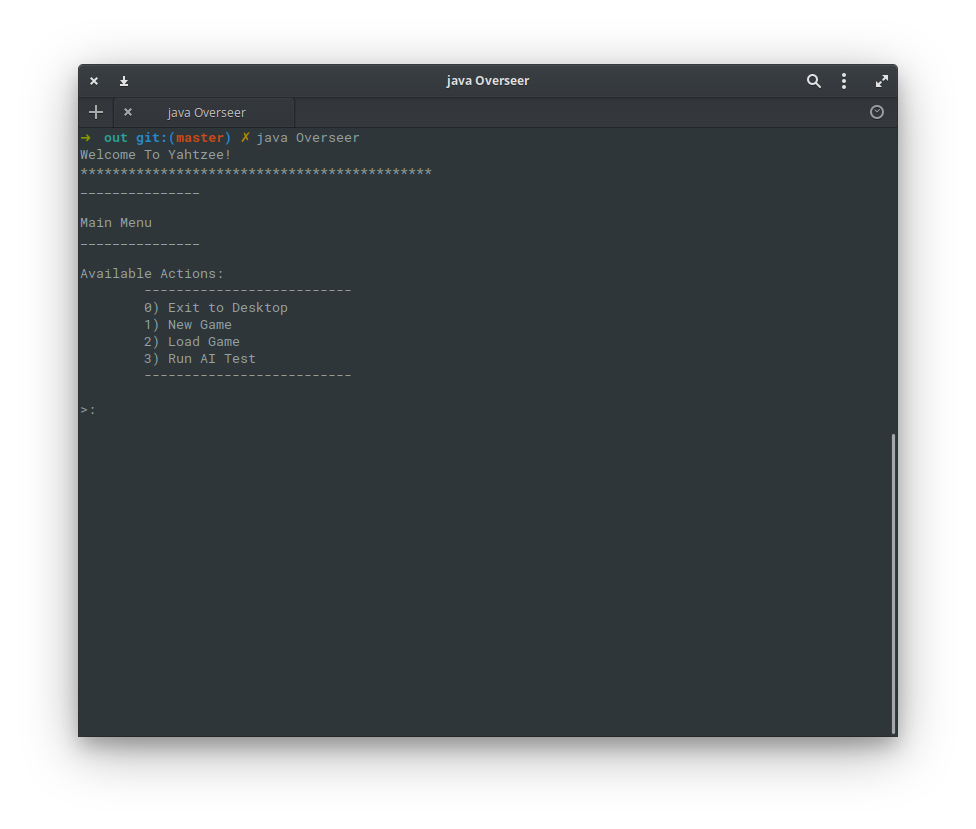
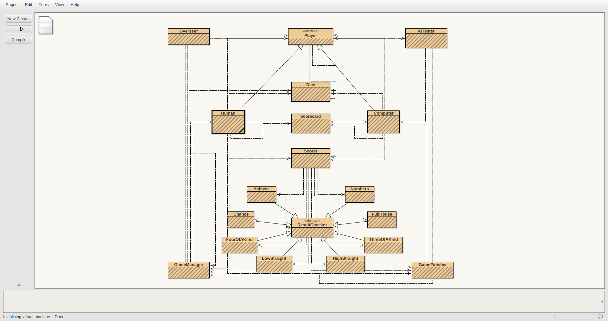

# Yahtzee



Coursework for a first-year computer science module. 

The brief was to create a playable game of Yahtzee with the following features:

- Game should be playable as both 'single-player' and 'multi-player'.
- It should have a challenging AI for use as 'non-human' players.
- It should have the ability to 'save' the game, and re-load a previous save game.
- Automated testing to benchmark the performance (read: average score) of the AI player.

## Requirements

Only base Java libraries are used, so I would presume this runs fine anywhere Java can, as long as the version is 7 or greater.

## Usage

This was originally written in [BlueJ](https://www.bluej.org/), and so can be opened and run from BlueJ.
The entry-point to the program is the `Overseer` class.
 

 
Alternatively, the program can be run directly from a terminal.

First, we must compile the program. The command below does this, and writes out the compiled files to `out/`.

```bash
javac -d out/ src/*.java
```

After compilation, the program can be run using `java` and pointing it to the main-class: `Overseer`. This must be done 
from the directory the compiled files were written out to (`out/`).


```bash
cd out/
java Overseer
```


